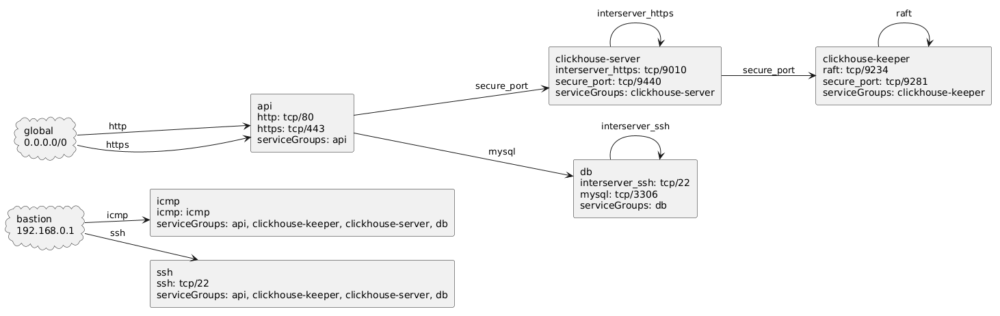

## plantuml
```
topowright -plantuml
```



## iptables

```
topowright
```

```
api1.example.com 10.0.0.1
  iptables -A INPUT -s 192.168.0.1 -p icmp -j ACCEPT -m comment --comment "from bastion to icmp"
  iptables -A INPUT -s 192.168.0.1 -p tcp --dport 22 -j ACCEPT -m comment --comment "from bastion to ssh"
  iptables -A INPUT -s 0.0.0.0/0 -p tcp --dport 80 -j ACCEPT -m comment --comment "from global to http"
  iptables -A INPUT -s 0.0.0.0/0 -p tcp --dport 443 -j ACCEPT -m comment --comment "from global to https"
  iptables -A INPUT -j DROP
api2.example.com 10.0.0.2
  iptables -A INPUT -s 192.168.0.1 -p icmp -j ACCEPT -m comment --comment "from bastion to icmp"
  iptables -A INPUT -s 192.168.0.1 -p tcp --dport 22 -j ACCEPT -m comment --comment "from bastion to ssh"
  iptables -A INPUT -s 0.0.0.0/0 -p tcp --dport 80 -j ACCEPT -m comment --comment "from global to http"
  iptables -A INPUT -s 0.0.0.0/0 -p tcp --dport 443 -j ACCEPT -m comment --comment "from global to https"
  iptables -A INPUT -j DROP
db1.example.com 10.0.0.3
  iptables -A INPUT -s 192.168.0.1 -p icmp -j ACCEPT -m comment --comment "from bastion to icmp"
  iptables -A INPUT -s 192.168.0.1 -p tcp --dport 22 -j ACCEPT -m comment --comment "from bastion to ssh"
  iptables -A INPUT -s 10.0.0.1 -p tcp --dport 3306 -j ACCEPT -m comment --comment "from api1.example.com to mysql"
  iptables -A INPUT -s 10.0.0.2 -p tcp --dport 3306 -j ACCEPT -m comment --comment "from api2.example.com to mysql"
  iptables -A INPUT -s 10.0.0.4 -p tcp --dport 22 -j ACCEPT -m comment --comment "from db2.example.com to interserver_ssh"
  iptables -A INPUT -j DROP
db2.example.com 10.0.0.4
  iptables -A INPUT -s 192.168.0.1 -p icmp -j ACCEPT -m comment --comment "from bastion to icmp"
  iptables -A INPUT -s 192.168.0.1 -p tcp --dport 22 -j ACCEPT -m comment --comment "from bastion to ssh"
  iptables -A INPUT -s 10.0.0.1 -p tcp --dport 3306 -j ACCEPT -m comment --comment "from api1.example.com to mysql"
  iptables -A INPUT -s 10.0.0.2 -p tcp --dport 3306 -j ACCEPT -m comment --comment "from api2.example.com to mysql"
  iptables -A INPUT -s 10.0.0.3 -p tcp --dport 22 -j ACCEPT -m comment --comment "from db1.example.com to interserver_ssh"
  iptables -A INPUT -j DROP
ch1.example.com 10.0.0.5
  iptables -A INPUT -s 192.168.0.1 -p icmp -j ACCEPT -m comment --comment "from bastion to icmp"
  iptables -A INPUT -s 192.168.0.1 -p tcp --dport 22 -j ACCEPT -m comment --comment "from bastion to ssh"
  iptables -A INPUT -s 10.0.0.1 -p tcp --dport 9440 -j ACCEPT -m comment --comment "from api1.example.com to secure_port"
  iptables -A INPUT -s 10.0.0.2 -p tcp --dport 9440 -j ACCEPT -m comment --comment "from api2.example.com to secure_port"
  iptables -A INPUT -s 10.0.0.6 -p tcp --dport 9010 -j ACCEPT -m comment --comment "from ch2.example.com to interserver_https"
  iptables -A INPUT -j DROP
ch2.example.com 10.0.0.6
  iptables -A INPUT -s 192.168.0.1 -p icmp -j ACCEPT -m comment --comment "from bastion to icmp"
  iptables -A INPUT -s 192.168.0.1 -p tcp --dport 22 -j ACCEPT -m comment --comment "from bastion to ssh"
  iptables -A INPUT -s 10.0.0.1 -p tcp --dport 9440 -j ACCEPT -m comment --comment "from api1.example.com to secure_port"
  iptables -A INPUT -s 10.0.0.2 -p tcp --dport 9440 -j ACCEPT -m comment --comment "from api2.example.com to secure_port"
  iptables -A INPUT -s 10.0.0.5 -p tcp --dport 9010 -j ACCEPT -m comment --comment "from ch1.example.com to interserver_https"
  iptables -A INPUT -j DROP
keeper1.example.com 10.0.0.7
  iptables -A INPUT -s 192.168.0.1 -p icmp -j ACCEPT -m comment --comment "from bastion to icmp"
  iptables -A INPUT -s 192.168.0.1 -p tcp --dport 22 -j ACCEPT -m comment --comment "from bastion to ssh"
  iptables -A INPUT -s 10.0.0.6 -p tcp --dport 9281 -j ACCEPT -m comment --comment "from ch2.example.com to secure_port"
  iptables -A INPUT -s 10.0.0.5 -p tcp --dport 9281 -j ACCEPT -m comment --comment "from ch1.example.com to secure_port"
  iptables -A INPUT -s 10.0.0.8 -p tcp --dport 9234 -j ACCEPT -m comment --comment "from keeper2.example.com to raft"
  iptables -A INPUT -s 10.0.0.9 -p tcp --dport 9234 -j ACCEPT -m comment --comment "from keeper3.example.com to raft"
  iptables -A INPUT -j DROP
keeper2.example.com 10.0.0.8
  iptables -A INPUT -s 192.168.0.1 -p icmp -j ACCEPT -m comment --comment "from bastion to icmp"
  iptables -A INPUT -s 192.168.0.1 -p tcp --dport 22 -j ACCEPT -m comment --comment "from bastion to ssh"
  iptables -A INPUT -s 10.0.0.6 -p tcp --dport 9281 -j ACCEPT -m comment --comment "from ch2.example.com to secure_port"
  iptables -A INPUT -s 10.0.0.5 -p tcp --dport 9281 -j ACCEPT -m comment --comment "from ch1.example.com to secure_port"
  iptables -A INPUT -s 10.0.0.7 -p tcp --dport 9234 -j ACCEPT -m comment --comment "from keeper1.example.com to raft"
  iptables -A INPUT -s 10.0.0.9 -p tcp --dport 9234 -j ACCEPT -m comment --comment "from keeper3.example.com to raft"
  iptables -A INPUT -j DROP
keeper3.example.com 10.0.0.9
  iptables -A INPUT -s 192.168.0.1 -p icmp -j ACCEPT -m comment --comment "from bastion to icmp"
  iptables -A INPUT -s 192.168.0.1 -p tcp --dport 22 -j ACCEPT -m comment --comment "from bastion to ssh"
  iptables -A INPUT -s 10.0.0.6 -p tcp --dport 9281 -j ACCEPT -m comment --comment "from ch2.example.com to secure_port"
  iptables -A INPUT -s 10.0.0.5 -p tcp --dport 9281 -j ACCEPT -m comment --comment "from ch1.example.com to secure_port"
  iptables -A INPUT -s 10.0.0.7 -p tcp --dport 9234 -j ACCEPT -m comment --comment "from keeper1.example.com to raft"
  iptables -A INPUT -s 10.0.0.8 -p tcp --dport 9234 -j ACCEPT -m comment --comment "from keeper2.example.com to raft"
  iptables -A INPUT -j DROP
```
